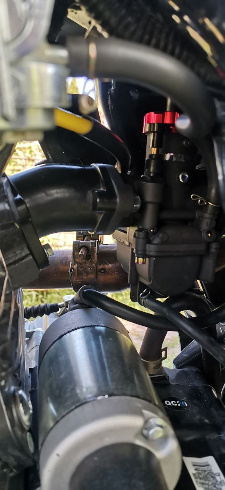

# Доработки впускной системы
Сборник доработок для мотоцикла Motoland Legend 250/300

## Разделы
1. [Параметры по умолчанию](#params)
2. [Установка карбюратора PZ30 с ускорительным насосом](#pz30w)
3. [Установка карбюратора PE28](#pe28)
4. [Установка карбюратора PE30](#pe30)
5. [Замена воздушного фильтра](#filter)

## Параметры по умолчанию 

1. Стандартный карбюратор - PZ30 без ускорительного насоса
2. Жиклеры стандартного карбюратора PZ30 - 102 основной и 35 хх. Жиклер хх с дополнительной проставкой. 

## Установка карбюратора PZ30 с ускорительным насосом 

На мотоцикл существует возможность установки карбюратора PZ30 с ускорительным насосом. Карбюратор устанавливается за место штатного, без проблем встает на штатные патрубки.
Единственная проблема с данным карбюратором - онг касается самим ускорительным насосом выхлопной трубы. Чтобы не допустить нагрева карбюратора от выхлопной трубы, можно подмотать участок касания на трубе термолентой (см. видео ниже).

Для карбюратора потребуется двойной тросик газа с креплением "с планкой" для установки в штатную ручку газа. Однако, в продаже такой трос не найти, и приходится собирать из двух разных тросиков посредством укорочения и пайки бобышки паяльной кислотой. Искусство пайки тросиков свободно можно найти в интернете. Если коротко - на конец тросика наматывается кусочек медного провода (без изоляции!), из которого формируется бобышка, которую, затем, с помощью паяльной кислоты пропитывают оловом и обтачивают надфилем/гриндером/etc для придания нужного вида.

[Карбюратор на озоне](https://ozon.ru/t/lQF4D7j)

[Трос часть 1](https://ozon.ru/t/dh0uP9L) - отсюда берется двойная часть  троса от карбюратора до центрального соединения

[Трос часть 2](https://ozon.ru/t/DL9bXCd) - юбка троса и сам трос укорачивается, вставляется в центральное соединение троса 1, и на кончик напаивается бобышка

[Видео с пояснением](https://rutube.ru/video/aedfc8af0b6ea0946d7a6b47b1c62315/)

## Установка карбюратора PE28 

На мотоцикл существует возможность установки карбюратора PE28 от Nibbi. Для этого потребуется заменить впускной патрубок. Штатный патрубок воздушного фильтра налезет на карбюратор, но, потребуется хомут подлиннее. Трос газа подойдет штатный.

[Карбюратор на озоне](https://ozon.ru/t/sxOwIgx)

[Впускной патрубок](https://ozon.ru/t/pTeIJqZ)

## Установка карбюратора PE30 

Установка PE30 аналогична установке PE28, они, во многом, сходны. На вход с трудом, но налезет патрубок от родного фильтрбокса, для его закрепления потребуется хомут чуть больше штатного, например, [такой](https://ozon.ru/t/iERfrOQ).
Манифолд подойдет для PE/PWK 28/30, например, [такой](https://ozon.ru/t/zDVqZgG).
Трос газа подойдет штатный.
Трос подсоса необходимо переделать под специальный подсос PE: Для этого можно просто купить [такой же трос](https://ozon.ru/t/lQnwh2r), как оригинальный, и переточить на нем напильником или гриндером нижнюю бобышку под [тросиковый подсос карбюратора](https://ozon.ru/t/Zgvp2cr). Ну, или поставить на карбюратор [ручной рычаг подсоса](https://ozon.ru/t/63MjefC). 

[Карбюратор на озоне](https://ozon.ru/t/dht716c)

[Впускной патрубок](https://ozon.ru/t/pTeIJqZ)

## Замена воздушного фильтра 

Штатный воздушный фильтр изготовлен из не очень хорошего поролона и при пропитках и мойках склонен к быстрому истрепанию, а замену ему найти проблематично. На сей момент в официальном магазине Регулмото их в продаже нет.
Можно вынуть из мотоцикла весь фильтрбокс, например, и поставить простой фильтр-нулевик.
Однако, устройство штатного фильтра очень простое, и его возможно склеить самому: Достаточно взять специальный поролон для фильтров (Например, с [Озона](https://ozon.ru/t/vImGGjY)), вырезать по размерам штатного фильтра два прямоугольника и аккуратно склеить их торцами наиритовым клеем. Самодельный фильтр работает не хуже штатного. 
