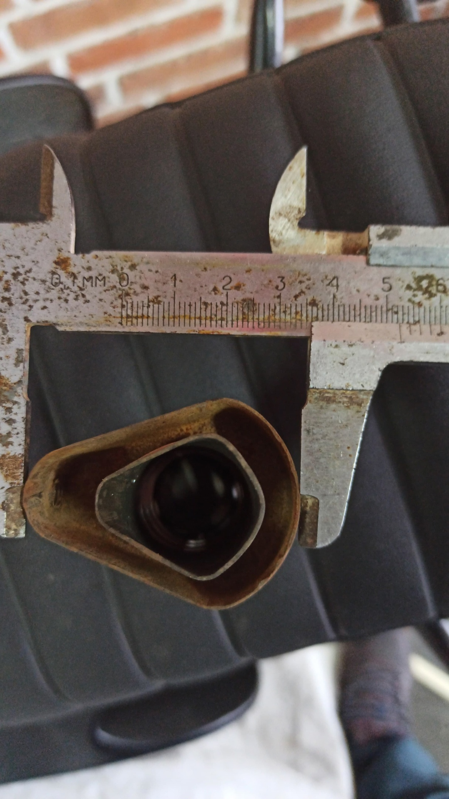
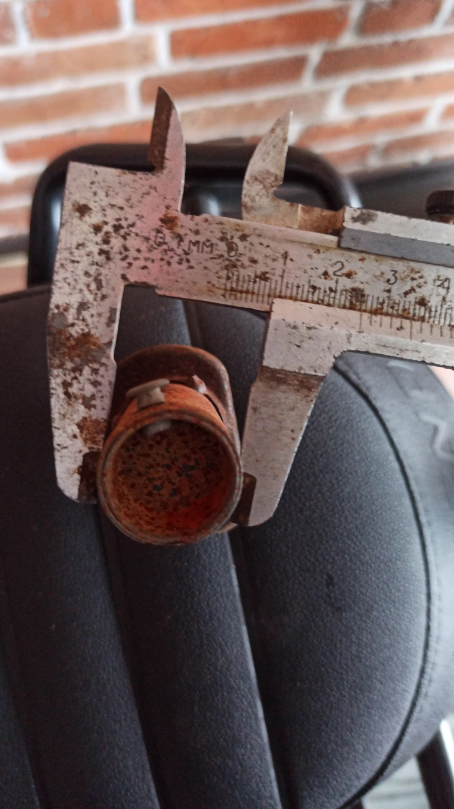
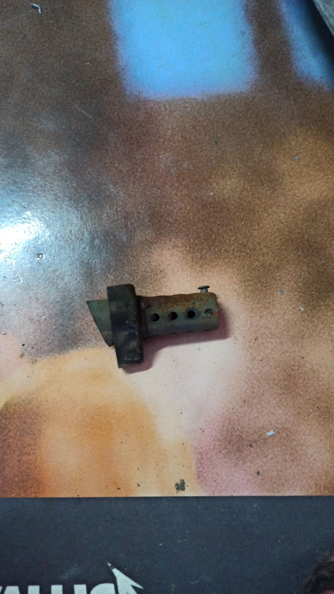

# Доработки связанные с выхлопной системой
Сборник доработок для мотоцикла Motoland Legend 250/300

## Разделы
1. [Параметры по умолчанию](#params)
2. [Размеры стандартной флейты в картинках](#fleyta)

## Параметры по умолчанию 

1. В разработке

## Размеры стандартной флейты в картинках 

