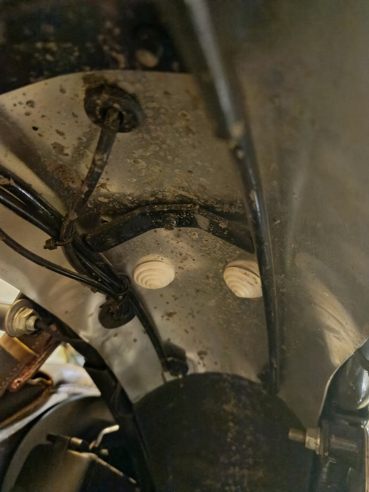
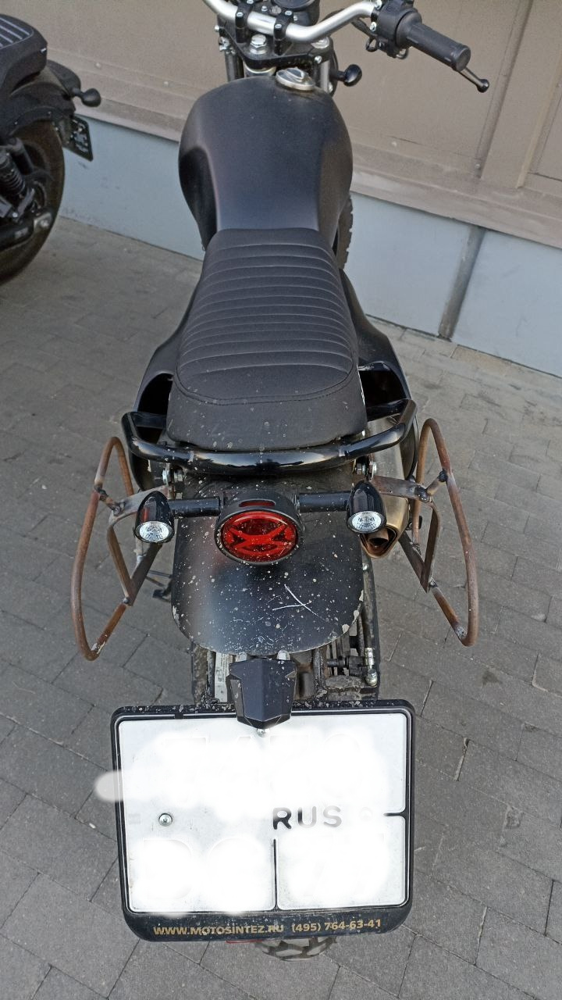
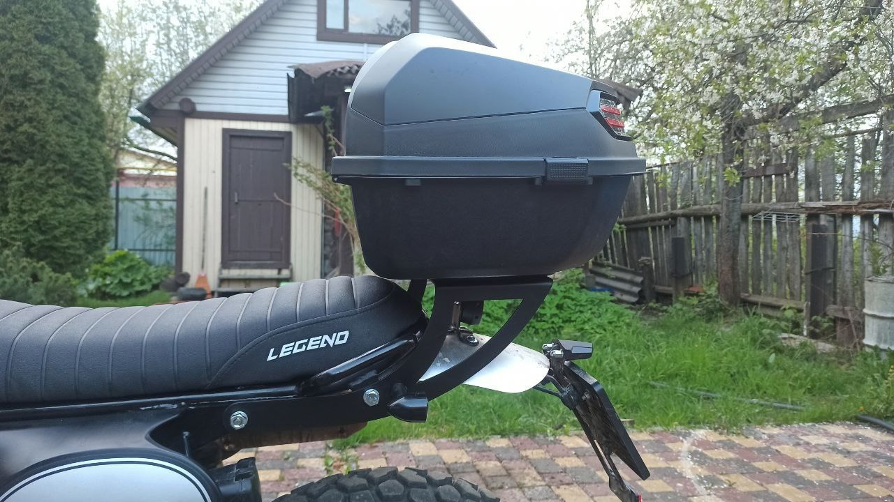

# Остальные доработки
Сборник доработок для мотоцикла Motoland Legend 250/300

## Разделы
1. [Параметры по умолчанию](#params)
2. [Заглушки для отверстий под гайки сидушки](#zagg)
3. [Варианты установки кофров](#sidebags)

## Параметры по умолчанию 

1. В разработке

## Заглушки для отверстий под гайки сидушки 
Приобретаются, например, на [Озоне](https://ozon.ru/t/wiqHn6r) и позволяют закрыть отверстия от попадания летящей снизу грязи.

## Варианты установки кофров 

