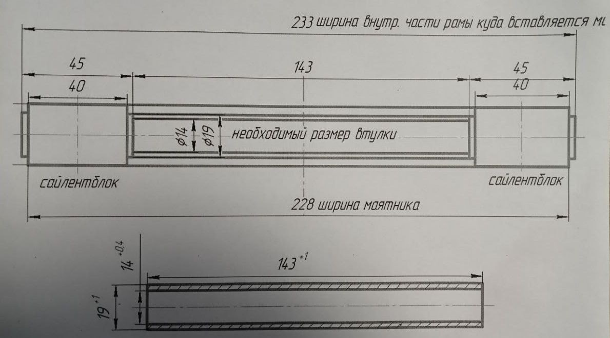

# Доработки подвески
Сборник доработок для мотоцикла Motoland Legend 250/300

## Разделы
1. [Параметры по умолчанию](#params)
2. [Замена амортизатора на газомасляный](#ammort)
3. [Замена сайлентблоков маятника](#silents)

## Параметры по умолчанию 

1. Штатный амортизатор масляный

## Замена амортизатора на газомасляный 

На замену штатного амортизатора подойдет любой газомасляный длиной 310-330мм и с диаметром посадочных отверстий 10мм. Рекомендуется выбирать амортизатор с диаметром пружины 12мм. Возможно, потребуется установить уплотнительные шайбы в проушины.

Пример: [Озон](https://ozon.ru/t/wiZHiJV)

## Замена сайлентблоков маятника 

Сайлентблоки на [Озоне](https://ozon.ru/t/yt7yEZA), Втулка проставочная на [Wildberries](https://www.wildberries.ru/catalog/255780442/detail.aspx)

Многие так же жалуются на странный неподходящий диаметр проставвочной втулки. Втулку подходящего диаметра можно выточить по размерам на схеме:

