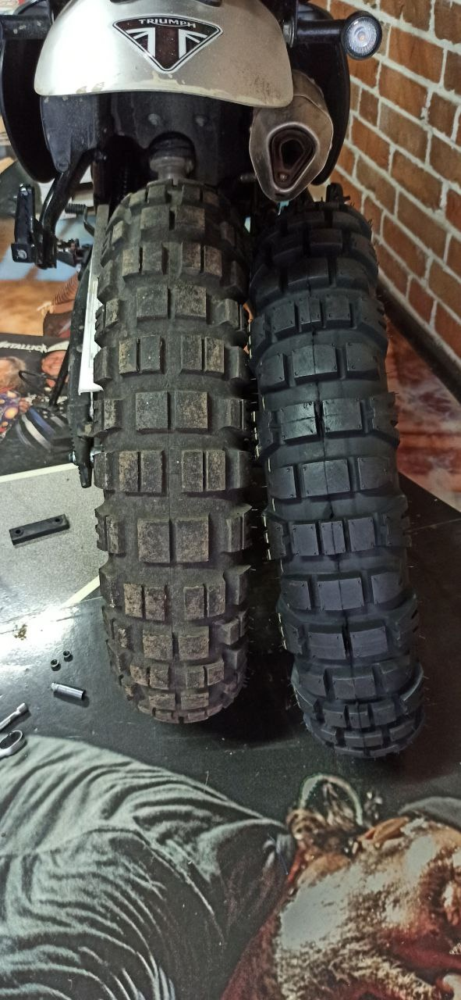

# Доработки связанные с шинами и колесными дисками
Сборник доработок для мотоцикла Motoland Legend 250/300

## Разделы
1. [Параметры по умолчанию](#params)
2. [Пример замены покрышек на Mitas](#mitas)

## Параметры по умолчанию 

1. Стандартные параметры покрышек:
   * Передняя: R18 4.10 дюйма или 110/90
   * Задняя: R17 4.60 дюйма или 120/90. Возможно установить до 140/90.

## Пример замены покрышек на Mitas 
[Задняя на Озоне](https://ozon.ru/t/j9w0y20)

[Передняя на Озоне](https://ozon.ru/t/RdQBOic)

